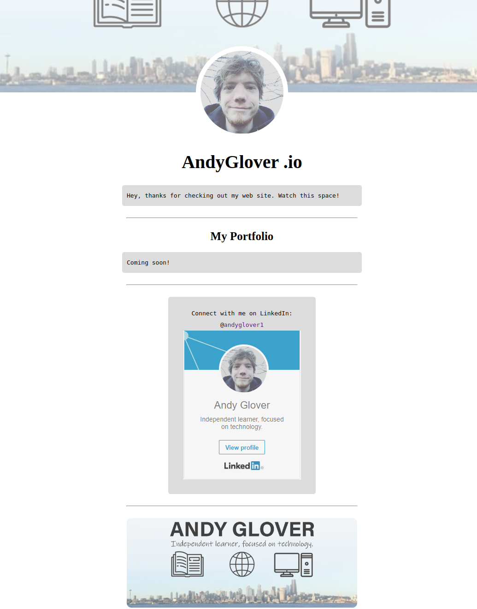

# ANDYGLOVER.IO

This is my old website, and my first page on Github, I think... (It's been a while!)

**Link to project:** http://www.andyglover.io

## How It's Made:

**Tech used:** HTML, CSS, Photoshop

This was my first time making a web development portfolio and I wanted to go all out! I've learned a bit more since then, and have since archived this page.

## Optimizations

One thing I would like to change about this is the responsiveness, this webpage is not very mobile friendly.

## Lessons Learned:

I spent a lot of time on this portfolio... I think probably more time than I spent on learning! But it was a lot of fun to put together!

## Examples:
Here's a few more repositories of mine you might like to check out:

**ANDYGLOVER.DEV:** https://github.com/andyglover/andyglover.dev

**Calculator:** https://github.com/andyglover/odin-calculator

**Rock Paper Scissors:** https://github.com/andyglover/odin-rock-paper-scissors

**GIF Thingy:** https://github.com/andyglover/gif-thingy

**Admin Dashboard:** https://github.com/andyglover/odin-project-admin-dashboard